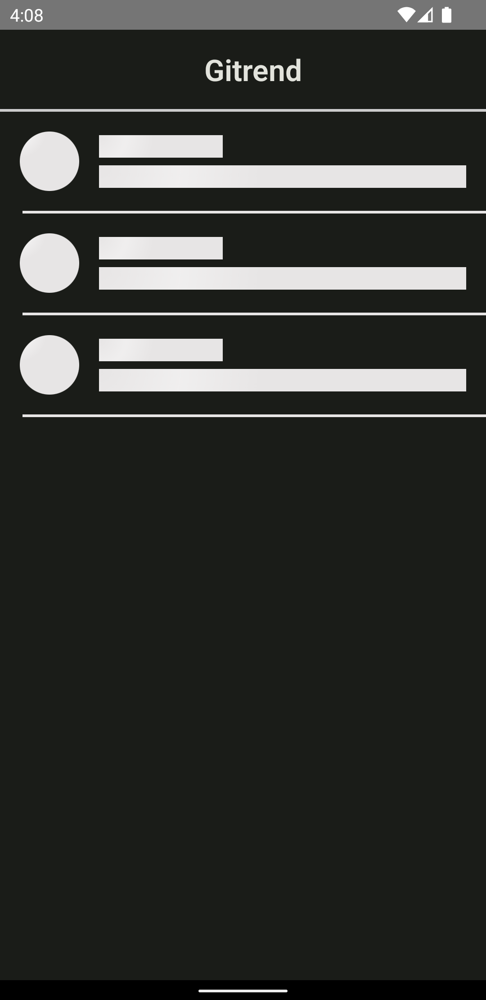
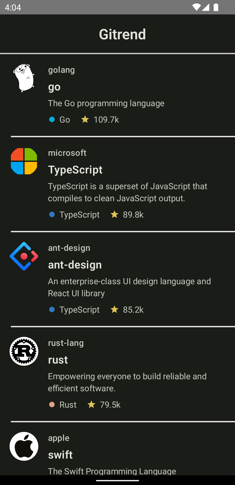
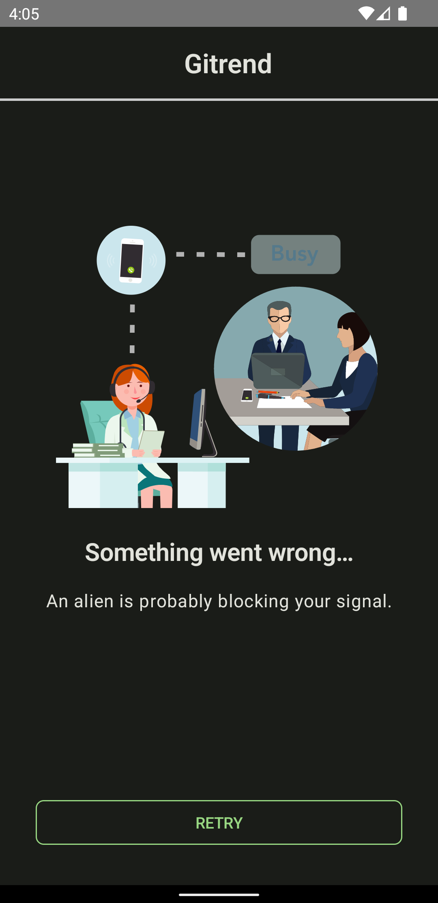

# Gitrend

Showcase app that lists current trending Github repositories

||||
|---|---|---|
||| |

### Tech

Data is being fetched from the REST api and augmented with programming language color from the
locally stored language catalogue.

* Clean Architecture
* Compose
* Hilt
* Coroutines
* Retrofit
* Lottie
* Light/Dark Theme
* Unit/Integration/UI tests

### API

* <a href="https://api.github.com/search/repositories?q=language+sort:stars">Github trending
  repositories</a>
* <a href="https://github.com/github/linguist/blob/master/lib/linguist/languages.yml">Github
  programming languages colors</a>

### Implementation Compromises

* Separation of concerns is respected via packages in a single module. Any significant scale of the
  real app would require separation on gradle modules level
* Primitive error handling based on exceptions. Given more time it's advised to adopt more
  functional Railway Oriented approach based on Result/Either return types.
  Example https://github.com/Ghedeon/Weather.
* Navigation wasn't required because of the single screen nature of the app. Otherwise Compose
  Navigation would be a good choice.

### Attributions

* Lottie loading animation: <a href="https://lottiefiles.com/4506-retry-and-user-busy-version-2">
  Rameez Mukadam</a>

### License

[Apache License, Version 2.0][1]

[1]: http://www.apache.org/licenses/LICENSE-2.0